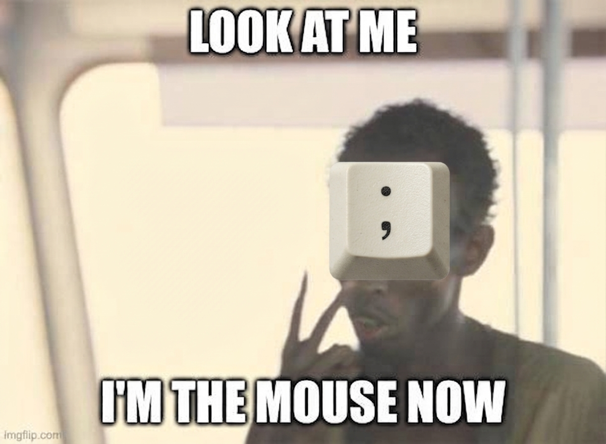

# imthemousenow



**Drive the mouse pointer from the keyboard on [Omarchy](https://omarchy.org).**

Press `SUPER + ;` and the window in front of you is covered in short labels.
Type one and the pointer goes there and clicks. No mouse, no trackpad, no
hunting for a cursor you lost two workspaces ago.

Under it is [wl-kbptr](https://github.com/moverest/wl-kbptr), which this plugin
drives rather than reimplements — so every wl-kbptr option passes straight
through — wrapped in Omarchy's keybindings, theme and bar conventions,
plus dragging, window swapping, a key sheet and a settings panel of its own.

📖 **[Read the manual](docs/manual/README.md)** — everything the plugin does.
This page is only what you need in order to install it and know what it touches.

## Requirements

- [Omarchy](https://omarchy.org) on Arch Linux, with Hyprland and the Omarchy
  shell (the bar widget and the on-screen word draw through its quickshell).
- `git`, `meson`, `ninja`, `jq`, `python3`. The build dependencies are installed
  for you if they are missing; `jq` and `python3` are already on an Omarchy box.
- An internet connection for the install, which compiles wl-kbptr from source.

## Install

```bash
git clone https://github.com/WidgetKing/imthemousenow.git
cd imthemousenow
./install.sh
```

| Flag | What it does |
| --- | --- |
| *(none)* | build wl-kbptr with OpenCV, wire everything up |
| `--dev` | install symlinked to this checkout, for hacking on it |
| `--lite` | build without OpenCV — hints label whole windows instead of detected targets, and the build loses a 100MB+ dependency |
| `--rebuild` | force the wl-kbptr build even when it looks current |
| `--no-build` | integration only, no compile |

Then press `SUPER + ;`, and `F1` inside the overlay to see what else you can
press.

To remove it:

```bash
./uninstall.sh            # put everything back
./uninstall.sh --purge    # and drop your settings too
```

## What it changes on your system

Nothing outside your home directory, except the one package it builds.

| What | Where |
| --- | --- |
| Plugin files | `~/.local/share/imthemousenow/`, with commands symlinked into `~/.local/bin/` |
| Hyprland keybindings | one `require(...)` line appended to `~/.config/hypr/hyprland.lua` (backed up first) |
| Bar widget | `~/.config/omarchy/plugins/imthemousenow/`, enabled on the bar |
| Theme colours | `~/.config/omarchy/themed/wl-kbptr.conf.tpl`, re-rendered on theme change |
| Hooks | one file each in Omarchy's `theme-set`, `font-set` and `post-update` hook directories |
| Your settings | `~/.config/omarchy/imthemousenow/config.toml`, written only when you change something |
| Runtime state | `$XDG_RUNTIME_DIR/imthemousenow/`, gone at logout |
| Package | `wl-kbptr-omarchy`, built with `makepkg` and installed with pacman, so it is owned and removable like anything else |

It takes over `SUPER + ;` and its modifier chords, and it rebinds
`CTRL + ALT + DELETE` — to a command that dismisses any overlay and *then* runs
Omarchy's own action for that key, so nothing is lost. While an overlay is up,
a Hyprland submap makes `;`, `Tab`, `F1`, `F5`, the digits and the arrows mean
something to the overlay; the submap is reset however the overlay exits,
including a crash.

`./uninstall.sh` reverses all of it, including taking the widget off the bar
before it removes the files.

## Privacy

**This plugin collects nothing.** No telemetry, no analytics, no crash
reporting, no identifiers, no usage counts — there is nowhere for such a thing
to go, because nothing here has a server.

It does not read, record or transmit what you type. The labels you type are
consumed by wl-kbptr locally to place the pointer; the plugin's own state
(which MODE is up, which window a swap started from) lives in
`$XDG_RUNTIME_DIR` and is deleted when the overlay closes, and everything there
is a mode name, a window address or a screen coordinate.

**Once installed, it never talks to the network.** Nothing here polls, phones
home or checks for updates — not even its own. The `post-update` hook runs
locally after an Omarchy update and only looks at your machine: whether the
binary still links, whether the Hyprland include is still there, whether the
key it chains to still exists.

The install is the one thing that uses the network, in the obvious way: `git
clone` of wl-kbptr's source, and pacman for the packages it needs to build.

## Security

- **It moves your pointer and clicks things.** That is the feature. It does so
  through Wayland's virtual-pointer protocol, as the user, on the compositor you
  are already logged into — it cannot reach another user's session.
- **The overlay holds the keyboard while it is up**, because that is how it can
  read a label without the window underneath getting it. Only one overlay ever
  runs (a lock file enforces it), so a second chord can never stack an
  unreachable grab on top of a live one. `imthemousenow --stop` and
  `CTRL + ALT + DELETE` both get you out; see
  [Getting unstuck](docs/manual/11-troubleshooting.md).
- **In [popup-safe mode](docs/manual/10-popup-safe-mode.md) it takes no
  keyboard focus at all** and reads its keys from a file in `$XDG_RUNTIME_DIR`,
  a directory only you can read. That mode is experimental but on by default;
  `keep_open = false` under `[imthemousenow.popups]` turns it off.
- **Nothing runs as root** except pacman during the install, which is the
  ordinary package-manager prompt.
- **wl-kbptr is built from a fork, and the version says which commit.**
  [WidgetKing/wl-kbptr](https://github.com/WidgetKing/wl-kbptr) is moverest's
  wl-kbptr at a pinned upstream commit with this plugin's changes on top, and
  the install builds the tip of its `imthemousenow` branch. The commit ends up
  in the package version, so `pacman -Q wl-kbptr-omarchy` tells you exactly
  which source produced your binary. Upstream only moves under the fork by a
  deliberate rebase there, never on your machine during an update.
- **Your config is validated before it is used.** One option wl-kbptr does not
  recognise makes it reject the entire config file, which would leave every
  chord silently doing nothing; `imthemousenow-config check` catches that, and
  the plugin asks the installed binary whether it supports an option before
  passing it.

Found a security problem? Open an issue, or mail the address in the commit log
if you would rather not say it in public.

## Contributing

The tests are shell scripts with no framework; run one directly, or all of them:

```bash
for t in tests/*.sh; do "$t" || break; done
```

[docs/design-notes.md](docs/design-notes.md) is what was verified against a real
machine and where the implementation departs from the plan;
[docs/lessons-learned.md](docs/lessons-learned.md) is what it cost to find that
out. Read the one that matches the thing you are about to change — several
decisions here look arbitrary and are not.
